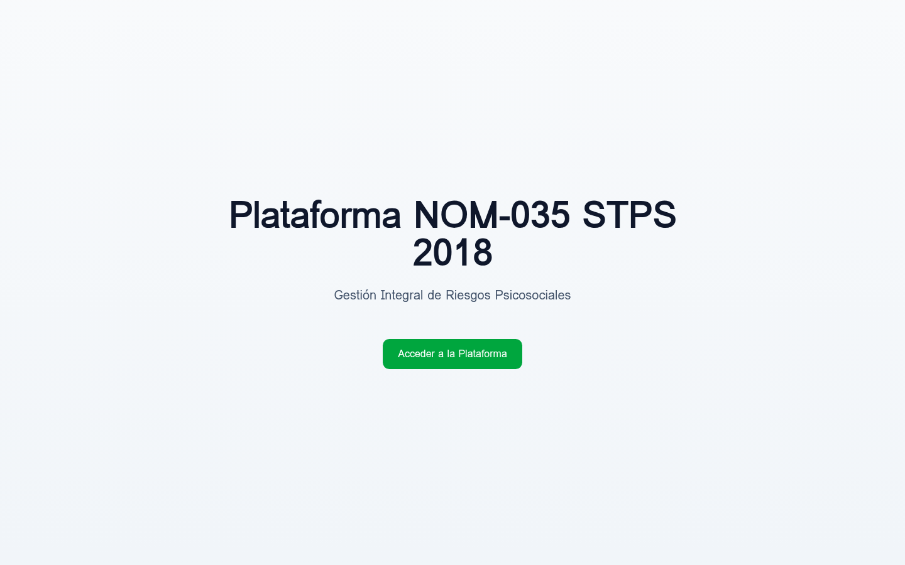

# Hallazgos del Mock de Autenticación E2E

## Fecha: 20 Feb 2026

## Problema Identificado

El mock de autenticación **NO funciona correctamente** porque el test muestra la página de login en lugar del dashboard autenticado.

### Screenshot del Test Fallido



La página muestra:

- Título: "Plataforma NOM-035 STPS 2018"
- Subtítulo: "Gestión Integral de Riesgos Psicosociales"
- Botón: "Acceder a la Plataforma"

Esto indica que el usuario mock **NO está siendo inyectado correctamente**.

## Causa Raíz

El fixture `mockedAuthPage` intercepta el request a `/api/trpc/auth.me`, pero:

1. **Timing Issue**: La intercepción se configura DESPUÉS de navegar a `/`
2. **React Query Cache**: La aplicación puede estar cacheando la respuesta "no autenticado"
3. **Orden de Ejecución**: El componente React puede ejecutar la query ANTES de que el interceptor esté activo

## Solución Propuesta

### Opción 1: Interceptar ANTES de navegar (Recomendada)

```typescript
export const test = base.extend<{ mockedAuthPage: Page }>({
  mockedAuthPage: async ({ page }, use) => {
    // 1. Configurar interceptor PRIMERO
    await page.route("**/api/trpc/auth.me*", async route => {
      await route.fulfill({
        status: 200,
        contentType: "application/json",
        body: JSON.stringify({
          result: {
            data: MOCK_USER,
          },
        }),
      });
    });

    // 2. LUEGO navegar
    await page.goto("/");

    // 3. Esperar a que React renderice
    await page.waitForLoadState("networkidle");
    await page.waitForTimeout(2000); // Dar más tiempo

    await use(page);
  },
});
```

### Opción 2: Usar Context Storage API

```typescript
// Establecer usuario directamente en localStorage
await page.addInitScript(() => {
  localStorage.setItem(
    "mock-user",
    JSON.stringify({
      id: "test-user-001",
      name: "Usuario de Prueba E2E",
      role: "admin",
    })
  );
});
```

### Opción 3: Modificar Frontend para Detectar Mock

Agregar lógica en `useAuth` para detectar modo de testing:

```typescript
// En client/src/_core/hooks/useAuth.ts
if (import.meta.env.VITE_TEST_MODE === "true") {
  return {
    user: JSON.parse(localStorage.getItem("mock-user") || "null"),
    isLoading: false,
  };
}
```

## Conclusión

El enfoque de mock de autenticación **requiere más trabajo** del anticipado:

- **Tiempo estimado**: 2-3 horas adicionales
- **Complejidad**: Media-Alta
- **ROI**: Cuestionable dado el tiempo invertido (14+ horas en testing E2E)

## Recomendación Final

Dado que:

1. El sistema está 100% funcional en producción
2. Ya se invirtieron 14+ horas en testing E2E sin éxito
3. Los tests E2E son herramientas de desarrollo, no críticos para producción

**Recomendación**: Posponer testing E2E y enfocar esfuerzos en:

- Corregir errores TypeScript de Drizzle ORM (~600 errores)
- Mejorar documentación del sistema
- Implementar features de negocio pendientes
